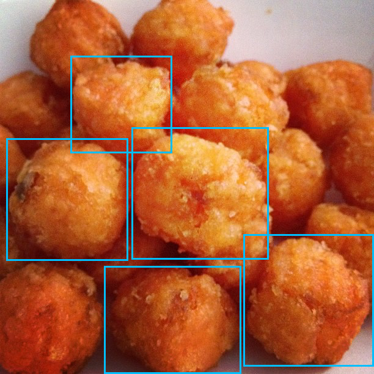

# Annotot
[](https://travis-ci.org/mejackreed/annotot)

Need to persist annotations quick and easily? Annotot, the original mini annotation API is for you. Don't annotate, annotot instead.



This logo, "Annotot", is a derivative of "[Sweet Potato Tator Tots](https://www.flickr.com/photos/flyfarther79/6270223411/)" by [Lisa Brettschneider](https://www.flickr.com/photos/flyfarther79/) used under [CC BY-NC 2.0](https://creativecommons.org/licenses/by-nc/2.0/). "Annotot" is also licensed under [CC BY-NC 2.0](https://creativecommons.org/licenses/by-nc/2.0/).

## Usage

Annotot provides a simple RESTful endpoint for persisting annotations. Just configure your client to work with its endpoint.

For Mirador integration, you can use the provided `AnnototEndpoint`:

```javascript
// Within Mirador creation options
...
annotationEndpoint: {
  name: 'Annotot',
  module: 'AnnototEndpoint',
  options: {
    endpoint: 'https://www.annotot.biz/annotot/annotations'
  }
},
...
```

If you want to configure Annotot to receive annotations from external sources make sure that you enable CORs in the Rails application. This can be done using [rack-cors](https://github.com/cyu/rack-cors).

## Installation
Add this line to your application's Gemfile:

```ruby
gem 'annotot'
```

And then execute:
```bash
$ bundle install
```

If you are serving both Mirador and Annotot in the same application, the integration will be easier. You can just require the `annotot_endpoint.js` file.

```javascript
//= require annotot/annotot_endpoint
```

## License
The gem is available as open source under the terms of the [Apache 2.0 License](https://opensource.org/licenses/Apache-2.0).
